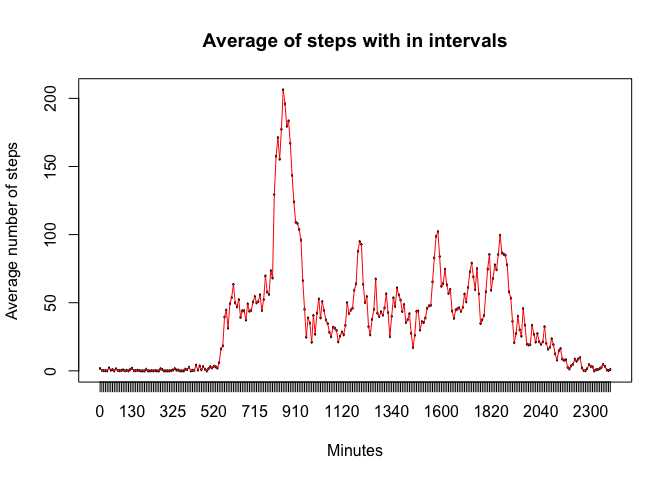

Load necessary libraries:


```r
library(dplyr)
library(lattice)
```

## Loading and preprocessing the data

Extract the data if doesnt extracted:


```r
if(!file.exists("activity.csv")){
    unzip ("activity.zip", exdir = "./")
}
data<-read.csv("activity.csv")
```

Convert date column to Date Class:


```r
data$date<-as.Date(data$date)
```

## What is mean total number of steps taken per day?

Calculate the total number of steps taken per day


```r
stepsPerDay<-with(data, tapply(steps, date, sum))
```

Make a histogram of the total number of steps taken each day


```r
hist(stepsPerDay, main="Histogram of Total Number of Steps Each Day", xlab="Number of Steps")
```

<!-- -->

Mean and median of the total number of steps taken per day


```r
summary(stepsPerDay)[c("Mean","Median")]
```

```
##     Mean   Median 
## 10766.19 10765.00
```

## What is the average daily activity pattern?

Make a time series plot (i.e. type="l") of the 5-minute interval (x-axis) and the average number of steps taken, averaged across all days (y-axis)


```r
stepsPer5Minutes<-with(data, tapply(steps, interval, mean, na.rm=TRUE))
stepsPer5Minutes<-as.data.frame.table(stepsPer5Minutes)
names(stepsPer5Minutes)<-c("Minutes", "Mean")
plot(stepsPer5Minutes$Minutes, stepsPer5Minutes$Mean, type="l", main="Average of steps with in intervals", xlab="Minutes", ylab="Average number of steps")
lines(stepsPer5Minutes$Minutes, stepsPer5Minutes$Mean, type="l", col="red")
```

<!-- -->

## Imputing missing values

Total number of missing values in the dataset


```r
sum(is.na(data))
```

```
## [1] 2304
```

Get means of all 5 minutes interval which has missing value


```r
missingValues<-stepsPer5Minutes$Mean[stepsPer5Minutes$Minutes %in% data$interval[is.na(data$steps)]]
```

Create a new dataset with missing data filled


```r
filledData<-data.frame(data)
filledData$steps[is.na(filledData$steps)]<-missingValues
```

Make a histogram of the total number of steps taken each day and Calculate and report the mean and median total number of steps taken per day.


```r
stepsPerDay<-with(filledData, tapply(steps, date, sum))
hist(stepsPerDay, main="Histogram of Total Number of Steps Each Day", xlab="Number of Steps")
```

<!-- -->

```r
summary(stepsPerDay)[c("Mean","Median")]
```

```
##     Mean   Median 
## 10766.19 10766.19
```

Mean is not changed and median is slightly increased. 

## Are there differences in activity patterns between weekdays and weekends?

Create a new factor variable in the dataset with two levels – “weekday” and “weekend” indicating whether a given date is a weekday or weekend day.


```r
filledData<-mutate(filledData, day_type = 
    factor(case_when(weekdays(data$date)==c("Saturday", "Sunday") ~ "weekend", TRUE ~ "weekday")))
```

Make a panel plot containing a time series plot of the 5-minute interval (x-axis) and the average number of steps taken, averaged across all weekday days or weekend days (y-axis).


```r
filledData_interval_means <- aggregate(steps ~ interval + day_type, filledData, mean)
xyplot(steps ~ interval | day_type,
       data = filledData_interval_means,
       type = "l",
       xlab = "Interval",
       ylab ="Number of steps",
       layout=c(1,2))
```

<!-- -->


